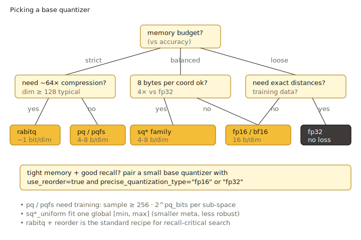

# Quantization

Vector quantization is the central memory/recall lever in VSAG. Every index
type stores vectors through a **base quantizer** (configured by
`base_quantization_type`), and may keep a second **precise quantizer** for
re-ranking (`precise_quantization_type` + `use_reorder: true`). This chapter
documents each supported quantizer: what it does, what JSON parameters it
takes, when it needs training, which metrics it supports, and when to choose
it.



## Storage and search pipeline

```
                 +---------------------+
   raw vector -->|  optional transform |   (TQ chain: pca / rom / fht / mrle)
                 +----------+----------+
                            |
                            v
                 +---------------------+
                 |   base quantizer    |   fp32 / fp16 / bf16 /
                 |                     |   sq8 / sq4 / sq8_uniform /
                 |                     |   sq4_uniform / pq / pqfs /
                 |                     |   rabitq
                 +----------+----------+
                            |
                            v
                  +-------------------+
                  |   index storage   |   (HGraph / IVF / Pyramid /
                  |                   |    BruteForce / SINDI)
                  +---------+---------+
                            |
                            v
                   graph / list walk
                            |
            +---------------+-----------------+
            |                                 |
   use_reorder: false                use_reorder: true
            |                                 |
            v                                 v
       top-K result               +---------------------+
                                  | precise quantizer   |  re-rank
                                  | (fp32 default;      |
                                  |  fp16/bf16/sq8 OK)  |
                                  +----------+----------+
                                             |
                                             v
                                        top-K result
```

`use_reorder` and `precise_quantization_type` are not specific to any single
quantizer — they apply whenever the index supports reordering (see
[HGraph](../indexes/hgraph.md), [IVF](../indexes/ivf.md),
[Pyramid](../indexes/pyramid.md)).

## Supported quantizers at a glance

The factory in `src/datacell/flatten_interface.cpp` dispatches to
the concrete quantizer based on the JSON `type` field.

| `base_quantization_type` | Bits / dim (approx.) | Needs training | Lossless | Typical use |
| --- | --- | --- | --- | --- |
| `fp32` | 32 | no | yes | Reference / precise reorder store |
| `fp16` | 16 | no | near-lossless | Half-precision storage; good default for high-dim float vectors |
| `bf16` | 16 | no | near-lossless | Same memory as `fp16`, wider dynamic range |
| `sq8` | 8 | **yes** | no | General memory-saving baseline |
| `sq4` | 4 | **yes** | no | Aggressive memory saving, expect recall drop without reorder |
| `sq8_uniform` | 8 | **yes** | no | SIMD-friendly SQ8 with global min/max |
| `sq4_uniform` | 4 | **yes** | no | SIMD-friendly SQ4; supports `sq4_uniform_trunc_rate` |
| `pq` | ~`pq_bits` × `pq_dim` / `dim` | **yes** | no | Codebook-based, very compact |
| `pqfs` | 4 × `pq_dim` / `dim` | **yes** | no | PQ FastScan — SIMD-accelerated PQ |
| `rabitq` | 1 (+ optional 7) | **yes** | no | 1-bit / 1+7-bit binary quantization, strongest compression |
| `tq` | depends on chain | depends on terminal quantizer | no | [Transform Quantizer](../advanced/quantization_transform.md): prepend rotations / PCA before another quantizer |

`int8` and `sparse` are not exposed as general-purpose
`base_quantization_type` values:

- `int8` is selected automatically when `dtype: "int8"` is used; it is not a
  compression mode.
- `sparse` backs the inverted lists of [SINDI](../indexes/sindi.md) and is
  not selectable on dense indexes.

## Training requirement

Quantizers marked **yes** above implement the `NEED_TRAIN` flag and require
either `Build` (which trains internally on the input vectors) or an explicit
`Train` call before `Add`. See [Build and Train](../advanced/build_and_train.md)
for the full lifecycle.

For HGraph the training data is the base vectors passed to `Build`; for IVF
the centroids are trained first and the residuals fed to the configured
base quantizer.

## Metric compatibility

All quantizers documented here support the three dense metrics
(`l2` / `ip` / `cosine`). For `cosine`, the index normalizes vectors before
quantization, so the underlying quantizer never sees the original magnitude.
A few practical notes:

- `pq` / `pqfs` perform their distance lookup tables per subspace; very low
  `pq_dim` (≤ 4) on `ip` / `cosine` is more sensitive to anisotropy than `l2`.
- `rabitq` works best when input vectors are decorrelated — either turn on
  `rabitq_use_fht` / `rabitq_pca_dim`, or wrap with a `tq` chain like
  `"pca, rom, rabitq"`.

## Choosing a quantizer

A pragmatic decision tree:

1. **Need exact distances or a precise reorder store?** Use `fp32`.
2. **Just want to halve memory with negligible recall loss?** Use `fp16`
   (or `bf16` if the data has a wide dynamic range, e.g. unnormalized
   embeddings).
3. **Want ~4× memory saving and willing to enable reorder?** Use `sq8` (or
   `sq8_uniform` for better SIMD throughput on `l2` / `ip`).
4. **Memory-tight and willing to lose more recall before reorder?** Use
   `sq4_uniform`.
5. **High-dim vectors, want strong compression with codebooks?** Use `pq`,
   or `pqfs` when the platform supports the SIMD path.
6. **Maximum compression (1-bit) and willing to pay reorder cost?** Use
   `rabitq`, ideally with `rabitq_use_fht: true` or a `tq` chain.

For every lossy quantizer above, enabling `use_reorder: true` with
`precise_quantization_type: "fp32"` is the standard way to recover recall at
the cost of extra memory; see the [HGraph parameter table](../indexes/hgraph.md#parameters)
for the exact behavior.

## Where quantization is exposed

Not every index exposes every parameter as an external key. As of today:

- **HGraph** exposes the richest set: `base_quantization_type`,
  `precise_quantization_type`, `use_reorder`, `base_pq_dim`,
  `rabitq_pca_dim`, `rabitq_bits_per_dim_query`,
  `rabitq_bits_per_dim_base`, `rabitq_version`, `rabitq_error_rate`,
  `rabitq_use_fht`, `sq4_uniform_trunc_rate`, `tq_chain`
  (see `src/algorithm/hgraph.cpp`).
- **IVF**, **Pyramid**, **BruteForce** expose `base_quantization_type` and
  the common reorder keys; some tunables (e.g. `tq_chain`) are wired
  internally but not exposed as external keys today.

Refer to each index page for its full parameter list.

## In this chapter

- [FP32 (Baseline)](fp32.md)
- [Half-Precision (FP16 / BF16)](fp16_bf16.md)
- [Scalar Quantization (SQ4 / SQ8)](sq.md)
- [Scalar Uniform (SQ4 / SQ8 Uniform)](sq_uniform.md)
- [Product Quantization (PQ)](pq.md)
- [PQ FastScan](pqfs.md)
- [RaBitQ](rabitq.md)
- [Transform Quantizer (TQ)](../advanced/quantization_transform.md)
