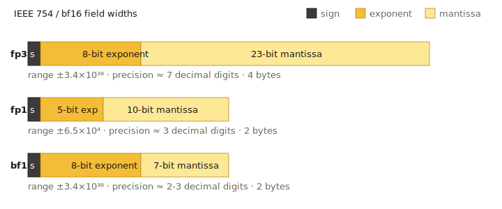

# Half-Precision (FP16 / BF16)

`fp16` and `bf16` store each coordinate in 16 bits instead of 32, cutting
code memory in half with **near-lossless** accuracy. They have no
quantizer-specific JSON parameters; the only difference is the bit layout
of the float format itself.



> Implementation: `src/quantization/scalar_quantization/half_precision_quantizer.cpp`
> with the type traits at `half_precision_traits.h`.
> Runnable example: `examples/cpp/321_index_fp16_hgraph.cpp`.

## FP16 vs BF16 at a glance

| Format | Sign | Exponent | Mantissa | Effective range | Precision |
| --- | --- | --- | --- | --- | --- |
| `fp16` | 1 | 5 | 10 | ~±6.55e4 | ~3 decimal digits |
| `bf16` | 1 | 8 | 7 | same as `fp32` (~±3.4e38) | ~2 decimal digits |

Practical implications:

- **`fp16`** keeps more mantissa bits — better precision for normalized
  embeddings whose values lie roughly in `[-1, 1]`. Standard choice for
  cosine-normalized vectors.
- **`bf16`** keeps the full `fp32` exponent range — safer for raw,
  un-normalized features (e.g. weighted sums, accumulator-like
  embeddings). Loses some precision compared to `fp16` on values close to
  zero.

If you do not know which one to pick, start with `fp16` for normalized
embeddings and `bf16` for unnormalized or wide-range data.

## When to use it

- Default "drop-in" memory saving on top of an `fp32` baseline. Recall
  loss is typically below 1% on standard benchmarks (SIFT, GIST,
  Glove, sentence embeddings).
- As a **precise reorder store** that is half the size of fp32:
  `precise_quantization_type: "fp16"` or `"bf16"` with
  `use_reorder: true`.
- High-dim float vectors where 32-bit storage is the bottleneck.

## Memory cost

`2 × dim` bytes per vector for the codes alone.

## Parameters

Neither `fp16` nor `bf16` has quantizer-specific JSON parameters.

```json
{
    "dtype": "float32",
    "metric_type": "l2",
    "dim": 768,
    "index_param": {
        "base_quantization_type": "fp16",
        "max_degree": 32,
        "ef_construction": 300
    }
}
```

Swap `"fp16"` for `"bf16"` to switch formats. The input `dtype` stays
`"float32"`: the quantizer converts on the fly.

## Training

Not required. Neither `fp16` nor `bf16` sets `NEED_TRAIN`.

## Metric compatibility

`l2`, `ip`, `cosine` — all supported. `cosine` is implemented by
normalizing inputs before storing them at 16-bit precision.

## When **not** to use it

- When you also need a memory-aggressive *base* quantizer such as `sq8` or
  `pq` — those already pull the storage well below 2 bytes/dim.
- When you need exact distances (use `fp32`).

## Related pages

- [Quantization overview](README.md)
- [HGraph index](../indexes/hgraph.md) — `precise_quantization_type` table
- [Memory Management](../advanced/memory.md)
