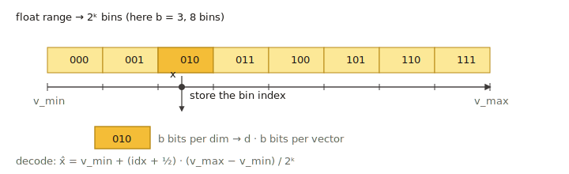

# Scalar Quantization (SQ4 / SQ8)

`sq8` and `sq4` are **per-dimension scalar quantizers**: each coordinate is
mapped from `float32` to an 8-bit (`sq8`) or 4-bit (`sq4`) integer using a
per-dimension `[min, max]` range learned during training. They share the
same implementation, parameterized by bit width, in
`src/quantization/scalar_quantization/scalar_quantizer.cpp` and
`scalar_quantizer_parameter.h`.

For SIMD-friendlier variants with a **global** `[min, max]`, see
[Scalar Uniform](sq_uniform.md).



## SQ4 vs SQ8 at a glance

| Type | Bits / dim | Memory vs fp32 | Typical accuracy | Notes |
| --- | --- | --- | --- | --- |
| `sq8` | 8 | ~1/4 | minor recall loss | General memory-saving baseline |
| `sq4` | 4 | ~1/8 | noticeable loss without reorder | Aggressive compression; pair with `use_reorder: true` |

The training is per-dimension `min`/`max`, so heavy-tailed coordinates can
waste code bits. If your data is anisotropic, consider either
[Scalar Uniform](sq_uniform.md) or a [Transform Quantizer](../advanced/quantization_transform.md)
chain like `"rom, sq8_uniform"` to rotate first.

## Memory cost (codes only)

- `sq8`: `dim` bytes per vector.
- `sq4`: `ceil(dim / 2)` bytes per vector.

There is also a small per-dimension range table (`8 × dim` bytes,
amortized across all vectors).

## Parameters

Neither `sq8` nor `sq4` has quantizer-specific JSON parameters today
(`scalar_quantizer_parameter.h:36-58`). The bit width is selected by the
`type` string alone.

```json
{
    "dtype": "float32",
    "metric_type": "l2",
    "dim": 128,
    "index_param": {
        "base_quantization_type": "sq8",
        "max_degree": 32,
        "ef_construction": 300,
        "use_reorder": true,
        "precise_quantization_type": "fp32"
    }
}
```

Replace `"sq8"` with `"sq4"` for 4-bit codes.

## Training

`NEED_TRAIN` is set. Training collects per-dimension `min` / `max` from a
sample of the input vectors. Calling `Build(base)` trains internally; on
indexes that require an explicit `Train` (some IVF flows), call it before
`Add`. See [Build and Train](../advanced/build_and_train.md).

## Metric compatibility

`l2`, `ip`, `cosine` — all supported. Distances are computed by decoding
the integer codes back to per-dimension scaled floats.

## When to choose `sq8` vs `sq4`

- **`sq8`**: default memory-saving choice for graph indexes (HGraph,
  Pyramid) when ~4× memory reduction is the target. Recall loss is small
  enough that `use_reorder` is often optional, but enabling it with
  `precise_quantization_type: "fp32"` is the safest setup.
- **`sq4`**: choose when memory is tight and you can afford a precise
  reorder store. Almost always pair with `use_reorder: true`.
- Pick `sq*_uniform` instead when the data is roughly homogeneous across
  dimensions; the uniform variants have higher SIMD throughput.
- For heavy-tailed / anisotropic data, prefer a [Transform Quantizer](../advanced/quantization_transform.md)
  chain that rotates before quantization.

## Related pages

- [Scalar Uniform (SQ4 / SQ8 Uniform)](sq_uniform.md)
- [Transform Quantizer](../advanced/quantization_transform.md)
- [Quantization overview](README.md)
