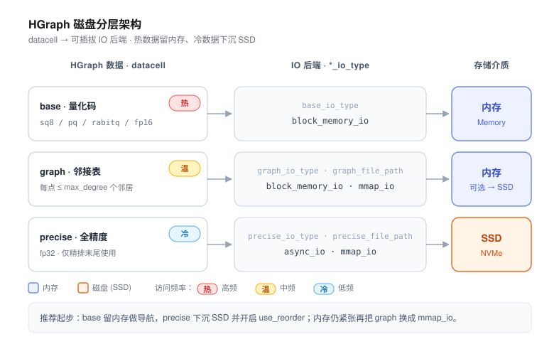
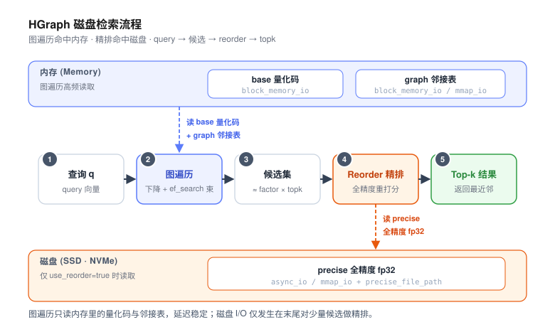

# 磁盘向量索引最佳实践

当数据规模增长到内存放不下全量向量时，把一部分数据下沉到磁盘（SSD）是控制成本的关键手段。
本文先梳理业界磁盘向量索引的设计空间，再落到 VSAG 的两条磁盘路线，给出可直接复制的配置、
容量估算与调优排错清单。

> 本文的“磁盘索引”指**把索引数据分层存放在内存 + 磁盘**，与“向量 + 属性”的混合检索无关；
> 后者请参见[属性过滤（混合搜索）](../advanced/attribute_filter.md)。

## 什么时候该上磁盘

并非数据一大就要上磁盘。先用下面几个信号判断：

| 信号 | 纯内存即可 | 考虑磁盘 |
|------|-----------|---------|
| 数据规模 | 千万级及以内 | 亿级 / 十亿级 |
| 全量 `fp32` 是否放得下内存 | 放得下 | 放不下 |
| 延迟预算 | 亚毫秒、极敏感 | 几毫秒～十几毫秒可接受 |
| 成本结构 | 内存成本可接受 | 希望用 SSD 替换大部分内存 |

一个快速的内存估算：全量 `fp32` 占用约为 `N × dim × 4` 字节。例如 `1e9 × 128 × 4 ≈ 512 GB`，
`1e8 × 768 × 4 ≈ 307 GB`——这类规模在单机内存里几乎不可能全放下，正是磁盘索引的目标场景。

磁盘路线的代价是每次查询会引入若干次随机读 I/O，因此**延迟会高于纯内存**。如果你的服务要求
亚毫秒级延迟且数据能压缩进内存，优先考虑纯内存的 [HGraph](../indexes/hgraph.md) + 量化。

## 业界设计空间

主流向量数据库的磁盘方案大体分为三类，核心思想高度一致：**内存放压缩近似、磁盘放精确全量，
用近似导航 + 精确重排（reorder）**。

| 方案 | 思路 | 代表实现 |
|------|------|---------|
| 图存盘（graph-on-disk） | 全精度向量与图的邻接表放 SSD，内存只放压缩码（如 PQ）用于导航与剪枝，beam search 时异步取盘 | Microsoft DiskANN、Milvus `DISKANN` |
| 簇 / 倒排存盘（cluster-on-disk） | 质心（centroid）放内存，倒排链 / posting list 放磁盘，按需读取候选簇 | Microsoft SPANN / SPFresh |
| mmap + 量化重排 | 用 mmap 让存储依赖操作系统页缓存，量化码留内存做粗排，磁盘上的原始向量做精排 | Qdrant `on_disk` / memmap + 量化 |

VSAG 同时覆盖了这三类思路，分别对应下文的两条路线。

## VSAG 的两条磁盘路线

VSAG 有两套磁盘能力，**新项目建议优先选择“现代可组合路线”**：

| 维度 | 现代可组合路线（`hgraph` / `ivf` + 磁盘 IO） | 传统 `diskann` |
|------|---------------------------------------------|----------------|
| 维护状态 | **推荐**，活跃演进 | 兼容保留（已标记 deprecated） |
| 架构 | 任意图 / 倒排索引 + 可插拔 IO 后端，把 `base` / `graph` / `precise` 分层放置 | 单体：PQ 压缩码在内存，Vamana 图与全精度向量在磁盘 |
| 量化灵活度 | `sq8` / `sq4` / `pq` / `pqfs` / `rabitq` / `fp16` 等自由组合 | 固定 PQ（可选 OPQ） |
| 在线增删 | `hgraph` 支持增量插入与删除 | 不支持，更新需重建 |
| 磁盘读取 | `mmap_io` / `buffer_io` / `async_io` 后端 + 文件路径 | 序列化后经 `ReaderSet` 反序列化读取 |
| 适用 | 新项目；需要增删、灵活量化、内存磁盘混合 | 既有 `diskann` 部署的兼容 |

> 说明：早期文档曾在“十亿级、内存受限”场景直接推荐 `diskann`。由于 `diskann` 已转为兼容保留，
> 当前更推荐用 `hgraph` / `ivf` 配合磁盘 IO 后端来覆盖同一场景。

下面分别给出两条路线的落地方案。

## 方案 A（推荐）：现代可组合磁盘索引

### 原理：datacell → IO 后端

VSAG 把存储拆成两层：**datacell**（量化码 / 图结构等逻辑数据）挂在一个可插拔的 **IO 后端**上。
通过把不同部分指向不同后端，即可实现“热数据在内存、冷数据在磁盘”的分层：

- `base`：参与图遍历 / 倒排扫描的**量化码**，访问最频繁，建议留内存；
- `graph`：图的邻接表，体积中等，可留内存或下沉到 `mmap_io`；
- `precise`：用于 reorder 的**全精度向量**（`fp32`），体积最大、只在末尾对候选打分，最适合下沉磁盘。

IO 后端一览：

| 后端（`*_io_type`） | 存储位置 | 需要 `file_path` | 说明 |
|---------------------|---------|------------------|------|
| `memory_io` | 内存（连续） | 否 | 基础内存存储 |
| `block_memory_io` | 内存（分块） | 否 | 大块内存的默认后端 |
| `buffer_io` | 磁盘（带缓冲 `pread`） | 是 | 通用磁盘读取 |
| `mmap_io` | 磁盘（mmap + 页缓存） | 是 | 工作集能放入页缓存时接近内存速度 |
| `async_io` | 磁盘（libaio 异步） | 是 | 高并发磁盘读；需 `VSAG_ENABLE_LIBAIO=ON`，未编译时回退 `buffer_io` |
| `reader_io` | 由自定义 `Reader` 提供 | 否 | 反序列化期通过 `ReaderSet` 读取（如远程 / 对象存储） |

落盘部分通过一组扁平参数配置：`base_io_type` / `base_file_path`、`graph_io_type` /
`graph_file_path`、`precise_io_type` / `precise_file_path`。

### HGraph + 磁盘（图索引路线）

HGraph 把数据拆成三部分，每部分都能单独指定 IO 后端、分别落到内存或磁盘：



推荐的“内存精简”配置：`base` 量化码留内存做导航，全精度 `precise` 下沉磁盘并开启 `use_reorder`：

```json
{
    "dtype": "float32",
    "metric_type": "l2",
    "dim": 128,
    "index_param": {
        "base_quantization_type": "sq8",
        "max_degree": 32,
        "ef_construction": 400,
        "use_reorder": true,
        "precise_quantization_type": "fp32",
        "precise_io_type": "async_io",
        "precise_file_path": "./hgraph_precise.data"
    }
}
```

搜索时照常设置 `ef_search`，reorder 会自动用磁盘上的全精度向量对候选重排：

```json
{"hgraph": {"ef_search": 200}}
```

检索时的数据流如下：图遍历只读内存中的量化码与邻接表，磁盘 I/O 仅发生在末尾对少量候选做精排：



内存仍然吃紧时，可进一步把**图**也下沉到 `mmap_io`（依赖页缓存，建议配合预热）：

```json
{
    "index_param": {
        "base_quantization_type": "rabitq",
        "use_reorder": true,
        "precise_quantization_type": "fp32",
        "precise_io_type": "async_io",
        "precise_file_path": "./hgraph_precise.data",
        "graph_io_type": "mmap_io",
        "graph_file_path": "./hgraph_graph.data"
    }
}
```

- `base` 越激进（`sq8` → `sq4` / `pq` / `rabitq`）越省内存，但召回更依赖 reorder；
- `graph` 下沉到 `mmap_io` 后，图遍历会触发随机读，务必走 NVMe 并预热页缓存。

### IVF + 磁盘（倒排 / 簇存盘路线）

IVF 没有图结构，天然贴合“簇存盘”：内存放质心与压缩码，磁盘放全精度做精排。

```json
{
    "dtype": "float32",
    "metric_type": "l2",
    "dim": 128,
    "index_param": {
        "buckets_count": 4096,
        "base_quantization_type": "sq8",
        "use_reorder": true,
        "precise_quantization_type": "fp32",
        "precise_io_type": "async_io",
        "precise_file_path": "./ivf_precise.data"
    }
}
```

搜索时用 `scan_buckets_count` 控制探测簇数，`factor` 控制送入精排的候选倍数：

```json
{"ivf": {"scan_buckets_count": 64, "factor": 2.0}}
```

IVF 的磁盘路线对**批量 / 高吞吐**尤其友好：簇可以自然映射到磁盘块，一次扫描读连续区域，
随机 I/O 比图遍历更可控。

## 方案 B：传统 DiskANN（兼容保留）

如果你在维护既有的 `diskann` 部署，或需要严格对齐 Microsoft DiskANN 的行为，可继续使用本路线。
完整代码见 [`examples/cpp/102_index_diskann.cpp`](https://github.com/antgroup/vsag/blob/main/examples/cpp/102_index_diskann.cpp)，
原理另见[内存-磁盘混合索引（DiskANN）](../advanced/hybrid_index.md)。

构建参数：

```json
{
    "dtype": "float32",
    "metric_type": "l2",
    "dim": 128,
    "diskann": {
        "max_degree": 32,
        "ef_construction": 400,
        "pq_sample_rate": 0.1,
        "pq_dims": 32,
        "use_pq_search": true,
        "use_async_io": true,
        "use_bsa": true
    }
}
```

搜索参数：

```json
{
    "diskann": {
        "ef_search": 100,
        "beam_search": 4,
        "io_limit": 50,
        "use_reorder": true
    }
}
```

| 参数 | 默认 | 说明 |
|------|------|------|
| `pq_dims` | — | 内存中 PQ 的子空间数，决定压缩率与精度；过小会掉召回 |
| `use_async_io` | — | 走 libaio 异步读盘，需 `VSAG_ENABLE_LIBAIO=ON` |
| `beam_search` | 4 | 每跳并发探测的 beam 宽度，越大召回越高、I/O 越多 |
| `io_limit` | 200 | 单次查询允许的最大 I/O 次数，是延迟的硬上限 |
| `use_reorder` | — | 末尾用全精度向量重排，提升精度 |

**磁盘检索机制**：`diskann` 通过“序列化 → 落盘 → `ReaderSet` 反序列化”实现磁盘检索。
序列化后产生两类文件——`*.index`（图结构）与 `*.data`（全精度向量），二者在反序列化时都需可达。
配合 `vsag::Factory::CreateLocalFileReader` 构造 `ReaderSet` 即可基于本地文件做磁盘检索，
`Reader` 也可自定义为远程 / 对象存储。

**限制**：`diskann` 不支持在线插入 / 删除，更新需重建索引。

## 硬件与部署

- **介质**：务必使用 NVMe SSD。HDD 的随机读延迟会比 SSD 差几个数量级，磁盘索引几乎不可用。
- **异步 IO**：要用 `async_io` 后端或 `diskann` 的 `use_async_io`，需在编译时打开
  `VSAG_ENABLE_LIBAIO=ON`（详见[编译构建](../development/building.md)）；未编译时 `async_io` 会回退到 `buffer_io`。
- **页缓存预热**：冷启动时随机读几兆、或顺序通读一遍磁盘文件，建立 page cache 后再放量，可显著降低首屏延迟。
- **容量估算**（以全精度 `fp32` 落盘、`sq8` 留内存为例）：
  - 内存 ≈ `base` 量化码（`N × dim × bytes_per_code`）（+ 图，若不落盘）；
  - 磁盘 ≈ `precise` 全精度（`N × dim × 4`）（+ 图，若落盘）。

## 调优与排错速查表

| 症状 | 处方 |
|------|------|
| 召回偏低 | 提高 `base` 量化位宽（`sq4` → `sq8` → `fp16`）；开启 `use_reorder`；增大 `ef_search` / `scan_buckets_count`；IVF 增大 reorder `factor`；DiskANN 增大 `ef_search` / `io_limit` |
| 延迟偏高 | 用 `async_io` 替代 `buffer_io`；预热页缓存并换用 NVMe；只让 `precise` 落盘、`graph` 留内存；减小 `ef_search` / `scan_buckets_count`；DiskANN 减小 `beam_search` / `io_limit` |
| 内存超预算 | `base` 改用更激进量化（`pq` / `rabitq`）；`graph` 下沉 `mmap_io`；`precise` 下沉磁盘 |

更系统的调参可结合[优化器（Tune）](../advanced/optimizer.md)与[性能评估工具](../resources/eval.md)做回归。

## 另请参阅

- [内存-磁盘混合索引（DiskANN）](../advanced/hybrid_index.md)
- [HGraph](../indexes/hgraph.md) ・ [IVF](../indexes/ivf.md)
- [索引参数](../resources/index_parameters.md)
- [序列化格式](../advanced/serialization.md) ・ [可扩展性](../advanced/extensibility.md)
- [最佳实践（总览）](../resources/best_practices.md)
- [关联项目](../resources/related_projects.md) ・ [科研论文](../resources/research_papers.md)
