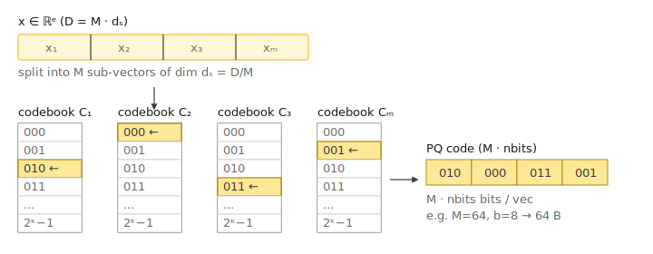

# 乘积量化（PQ）

乘积量化把一个向量切成 `pq_dim` 个等长的**子向量**，每个子向量独立地按
含 `2^pq_bits` 个中心的小型码本进行量化。最终存储的码为每向量
`pq_dim × pq_bits` 比特——比 `fp32` 小数量级。查询时的距离计算通过每查询
预先计算的查找表（LUT）完成。



> 实现：`src/quantization/product_quantization/product_quantizer.cpp`，
> 参数文件 `product_quantizer_parameter.cpp`。

## 何时使用

- **高维浮点向量（≥ 256 维）**，且 `sq8` 仍嫌过大。
- **内存紧张、精度可接受**的工作负载，需要相对 fp32 约 16× 压缩。
- 配合 `use_reorder: true` 与一个小型 `fp16`/`fp32` 精确存储，PQ 是大规模
  场景下"压缩图索引"的标准配方。

如需在 `pq_bits = 4` 时获得更高的 SIMD 吞吐，见 [PQ FastScan](pqfs.md)。

## 内存代价（仅码）

每向量 `ceil(pq_dim × pq_bits / 8)` 字节，外加一份只存一次的小型码本
（`pq_dim × 2^pq_bits × subspace_dim × 4` 字节）。以典型配置
（`pq_dim = 32`、`pq_bits = 8`、`dim = 128`）为例：

- 码大小 = `32 × 8 / 8 = 32` 字节/向量（对比 fp32 的 `128 × 4 = 512`
  → 小 16×）。

## 参数

| Key | 类型 | 默认 | 含义 |
| --- | --- | --- | --- |
| `pq_dim` | int | `1` | 子向量数量。必须整除 `dim`。取值越大，量化越细，但码本数量与码大小也会变大（`product_quantizer_parameter.h:38`）。 |
| `pq_bits` | int | `8` | 每个子向量的位数（1–8）。取 `8` 时每个子向量一字节。`8` 最稳；4 位 SIMD 变种见 [PQ FastScan](pqfs.md)。 |

在 HGraph 上，这些以顶层 key `base_pq_dim` 与 `pq_bits` 暴露
（`src/algorithm/hgraph.cpp:465-472`）。

```json
{
    "dtype": "float32",
    "metric_type": "l2",
    "dim": 128,
    "index_param": {
        "base_quantization_type": "pq",
        "base_pq_dim": 32,
        "max_degree": 32,
        "ef_construction": 300,
        "use_reorder": true,
        "precise_quantization_type": "fp16"
    }
}
```

## 训练

设置了 `NEED_TRAIN`。训练在每个子空间上跑 k-means 来学习 `2^pq_bits` 个
中心；这通常是所有内建量化器中最贵的训练步骤。每个子空间使用至少
`256 × 2^pq_bits` 个训练样本，码本会更稳定；`Build(base)` 会自动从输入
采样。

## 度量兼容性

`l2`、`ip`、`cosine`——全部支持。查询时距离通过每子空间的 LUT 计算：
`l2` 使用查询子向量与每个中心的 L2 平方；`ip` 使用点积。`cosine` 在预
归一化向量上等价于 `ip`。

## 实践要点

- `pq_dim` 应整除 `dim`。常用比例是 `dim/4` 或 `dim/8`。
- 极小的 `pq_dim`（如 `dim/16`）能得到非常紧凑的码，但召回会迅速下降；
  务必配合重排。
- 对各向异性数据，在 PQ 前接一层旋转变换能显著提升召回：用
  [量化变换](../advanced/quantization_transform.md) 链路如 `"rom, pq"`。

## 相关页面

- [PQ FastScan](pqfs.md)
- [量化变换](../advanced/quantization_transform.md)
- [HGraph 索引](../indexes/hgraph.md)
- [量化总览](README.md)
