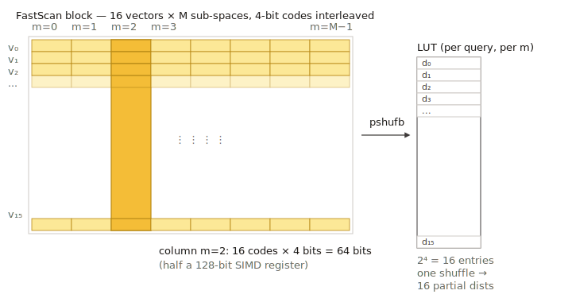

# PQ FastScan

`pqfs` 是 [乘积量化](pq.md) 的一个 SIMD 加速变种：将 `pq_bits` 固定为 4，
并采用专为 AVX-2 / AVX-512 "FastScan" 查表内核设计的内存布局。代价是仅
支持 4 位，但能带来显著更高的距离计算吞吐。



> 实现：`src/quantization/product_quantization/pq_fastscan_quantizer.cpp`，
> 参数文件 `pq_fastscan_quantizer_parameter.cpp`。

## 何时使用

- 平台有 AVX-2（最好还有 AVX-512）；FastScan 内核正是选用 `pqfs` 而非
  `pq` 的主要理由。
- 关注的不只是内存，还有搜索吞吐。
- 4 位子空间码本（每子向量 16 个中心）能满足召回目标——通常配合重排即
  可。

如果平台不具备所需的 SIMD 宽度，请回退到普通 [`pq`](pq.md)。

## 内存代价（仅码）

每向量 `ceil(pq_dim / 2) = (pq_dim + 1) / 2` 字节——奇数和偶数 `pq_dim`
都支持（`src/quantization/product_quantization/pq_fastscan_quantizer.cpp:41`）。
码本：`pq_dim × 16 × subspace_dim × 4` 字节——因为每子空间只有 16 个中心，
比 8 位 `pq` 的码本小很多。

## 参数

| Key | 类型 | 默认 | 含义 |
| --- | --- | --- | --- |
| `pq_dim` | int | `1` | 子向量数量。必须整除 `dim`。`pq_bits` 在内部**固定为 4** 且不可配（`pq_fastscan_quantizer_parameter.cpp:28-33`）。 |

在 HGraph 上以 `base_pq_dim` 暴露（`src/algorithm/hgraph.cpp:465-472`）。

```json
{
    "dtype": "float32",
    "metric_type": "l2",
    "dim": 128,
    "index_param": {
        "base_quantization_type": "pqfs",
        "base_pq_dim": 32,
        "max_degree": 32,
        "ef_construction": 300,
        "use_reorder": true,
        "precise_quantization_type": "fp16"
    }
}
```

## 训练

设置了 `NEED_TRAIN`。在每子空间训练 16 中心码本；比 `pq` 的 256 中心训练
更便宜。

## 度量兼容性

`l2`、`ip`、`cosine`——覆盖与 `pq` 一致。LUT 布局因度量而异，但由量化器
透明处理。

## 实践要点

- `pq_dim` 最好是内核预期 SIMD 批宽的倍数（实现在 AVX-512 上内部使用
  32）。拿不准时，选 `pq_dim ∈ {32, 64, 96, 128}`。
- 相对 `pq` 的优势是**相同召回下的吞吐**，而非内存（4 位码本身就小，但
  `pq` 设 `pq_bits = 4` 同样能匹配大小）。
- 想最大化召回恢复，配合 `use_reorder: true` 与 `fp16` 或 `fp32` 精确
  存储。

## 相关页面

- [乘积量化（PQ）](pq.md)
- [HGraph 索引](../indexes/hgraph.md)
- [量化变换](../advanced/quantization_transform.md)
- [量化总览](README.md)
