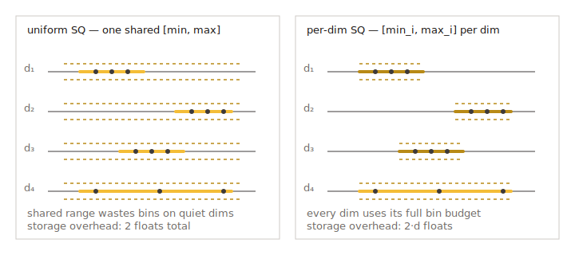

# Uniform 标量量化（SQ4 / SQ8 Uniform）

`sq8_uniform` 与 `sq4_uniform` 与 [`sq8` / `sq4`](sq.md) 类似，是标量量化
器，但它们学习的是**全局唯一**的 `[min, max]` 范围，对所有维度都使用同一
份缩放参数。这一权衡——逐维自适应能力略弱，但解码路径更简单——换来了
显著更快的 SIMD 距离计算（`l2` 与 `ip`），并保持更紧凑的码布局。



> 实现：`src/quantization/scalar_quantization/sq8_uniform_quantizer.cpp`、
> `src/quantization/scalar_quantization/sq4_uniform_quantizer.cpp`。

## 何时使用

- **HGraph / IVF / Pyramid 的热路径。** 当瓶颈在基础量化器距离计算时，
  在相近召回下，`sq8_uniform` / `sq4_uniform` 几乎总是比对应的非 uniform
  变种更快。
- **维度间取值范围相近的数据。** 归一化嵌入（cosine），或已通过
  [量化变换](../advanced/quantization_transform.md) 链路（如
  `"rom, sq8_uniform"` 或 `"fht, sq8_uniform"`）旋转过的向量，都是理想
  输入。
- **作为 `tq` 链路的末端量化器。** 最常见的链路是
  `"pca, rom, sq8_uniform"`，参考示例 501。

## SQ4 uniform 与 SQ8 uniform 对比

| 类型 | 每维位数 | 相对 fp32 内存 | 典型精度 |
| --- | --- | --- | --- |
| `sq8_uniform` | 8 | ~1/4 | 轻微召回下降 |
| `sq4_uniform` | 4 | ~1/8 | 需重排以保持高召回 |

## 参数

| Key | 类型 | 默认 | 适用 | 含义 |
| --- | --- | --- | --- | --- |
| `sq4_uniform_trunc_rate` | float | `0.05` | 仅 `sq4_uniform` | 对离群值的对称截断比例（`src/quantization/scalar_quantization/sq4_uniform_quantizer_parameter.h:39`）。值越大，越多极端坐标被截断，从而减少主体数据的范围浪费，代价是尾部被裁掉。 |

`sq8_uniform` 没有量化器专属的 JSON 参数。

在 HGraph 上，`sq4_uniform_trunc_rate` 作为顶层 key 暴露，并被映射到
嵌套的量化参数中（`src/algorithm/hgraph.cpp:409-416`）。

```json
{
    "dtype": "float32",
    "metric_type": "l2",
    "dim": 128,
    "index_param": {
        "base_quantization_type": "sq4_uniform",
        "sq4_uniform_trunc_rate": 0.05,
        "max_degree": 32,
        "ef_construction": 300,
        "use_reorder": true,
        "precise_quantization_type": "fp32"
    }
}
```

若需 8 位变种，把 `"base_quantization_type"` 设为 `"sq8_uniform"` 并去掉
`trunc_rate` key 即可。

## 训练

设置了 `NEED_TRAIN`。训练在所有维度上估计单一的 `[min, max]`
（`sq4_uniform` 时可附加截断）。`Build` 会内部完成训练。

## 度量兼容性

`l2`、`ip`、`cosine`——全部支持。`cosine` 会先归一化再量化，这也使得 uniform
缩放在该度量下接近最优。

## uniform 与非 uniform 之间如何选

- 数据已归一化（`cosine` 或预归一化 `l2`）→ 选 **uniform**。
- 数据各维度取值范围差异极大（如混合特征块）→ 先尝试非 uniform 的
  [`sq*`](sq.md)，或在旋转变换后再用 uniform（`"rom, sq*_uniform"`）。
- 吞吐比最后一点点召回更重要 → **uniform**。

## 相关页面

- [标量量化（SQ4 / SQ8）](sq.md)
- [量化变换](../advanced/quantization_transform.md)
- [量化总览](README.md)
