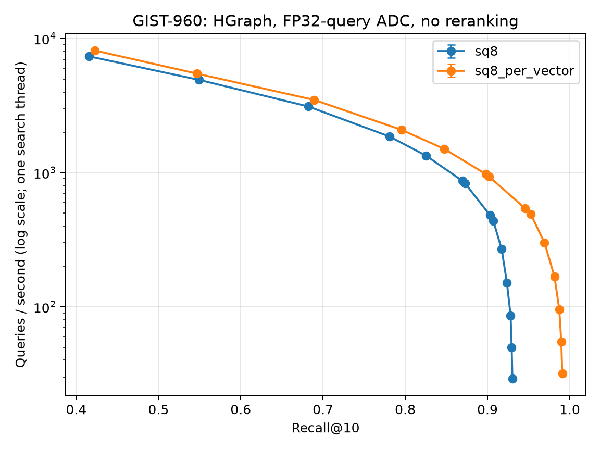

# GIST-960: per-vector SQ8 versus trained per-dimension SQ8

Per-vector SQ8 achieved **1.85× QPS at matched 90% recall** in this end-to-end HGraph experiment. It reached both 95% and 99% recall without FP32 reranking; baseline SQ8 did not reach those targets in the sweep.



[Standalone SVG](gist960-recall-qps.svg) · [All raw repetitions](gist960-raw.csv) · [Manifest](gist960-manifest.json)

## Method

- Full public [GIST-960 Euclidean](https://ann-benchmarks.com/gist-960-euclidean.hdf5): 1,000,000 base vectors, 1,000 official queries, 960 dimensions, official top-10 ground truth, no preprocessing. HDF5 size 3,844,648,288 bytes; SHA-256 `8e95831936bfdbfa0a56086942e2cf98cd703517c67f985914183eb4cdbf026a`.
- Source commit `869762498fb1fb38541b9a9a4aa3400457064635`; same GCC 15.2.0 Release executable and shared library, AVX-512 dispatch, AMD EPYC 9T24 (96 cores / 192 logical CPUs). Executable/library checksums are in the manifest. The repository Release build includes `-Ofast`. A GCC15 warning in an unchanged Pyramid test was retained with `-Wno-error=stringop-overflow`.
- HGraph L2, explicit NSW, degree 32, construction ef 200, 16 build threads, built-in level RNG seed 2021. Common `train_sample_count=1000000` bypasses HGraph's unseeded random reservoir. SQ8's existing deterministic stride sampling (up to 100,000 vectors), truncated per-dimension bounds and encoding are unchanged. Per-vector SQ8 fits each vector's minimum/step and rounds to nearest code. Both use FP32 query ADC and `use_reorder=false`.
- Each quantizer constructs its own graph. Parallel build scheduling is not deterministic; these are separate end-to-end indexes, not a shared-graph kernel comparison. One build per quantizer; the query repetitions do not measure build-to-build variance.
- Baseline then candidate, sequentially; one search thread pinned to CPU 24. Other test workloads were paused throughout timing. At every ef, one complete 1,000-query warmup preceded three measured complete passes. QPS = successful queries / monotonic search-phase wall seconds; loading, build, serialization, recall validation and plotting were excluded. All 84 measured passes completed 1,000 successful queries, with zero failures.
- The plot uses logarithmic QPS and shows median with min/max repetition bars. Matched-recall estimates use **linear interpolation of measured median-QPS points**, without extrapolation. The observed maxima are limited to the sweep. A separate exhaustive ADC scan uses the actual quantizers, all codes, all official queries, 16 threads and ID tie-breaking; it is an accuracy reference, not a QPS measurement or a strict mathematical upper bound on approximate-search recall.

## Matched recall

| Recall@10 | SQ8 QPS | Per-vector SQ8 QPS | Ratio |
| --- | ---: | ---: | ---: |
| 90% | 516.83 | 955.40 | 1.85× |
| 95% | Not reached | 510.00 | — |
| 99% | Not reached | 49.12 | — |

## Footprint and accuracy reference

Memory below is the library-reported **allocated capacity**, not process RSS. Both code stores fit the same allocation capacity, so the extra per-vector metadata is visible in encoded payload and serialization but largely hidden in this allocation measure. SQ8 also owns 7,680 bytes of trained bound/range arrays that its `sizeof`-based quantizer estimate does not include. Serialized sizes include different constructed graphs.

| Quantity | SQ8 | Per-vector SQ8 |
| --- | ---: | ---: |
| Build seconds (one build each) | 72.1527 | 63.2044 |
| Reported index allocation, bytes | 1,296,536,000 | 1,296,535,952 |
| Serialized index, bytes | 1,114,096,388 | 1,122,071,487 |
| Encoded base payload, bytes | 960,000,000 | 968,000,000 |
| Per-vector metadata in payload, bytes | 0 | 8,000,000 |
| Highest measured HGraph recall | 93.03% | 99.09% |
| Exhaustive ADC reference recall | 93.28% | 99.27% |

## All measured configurations

Recall is identical across the three repeats of each configuration. Every QPS entry is median [minimum, maximum].

| ef_search | SQ8 recall | SQ8 QPS [min, max] | Per-vector recall | Per-vector QPS [min, max] |
| ---: | ---: | ---: | ---: | ---: |
| 10 | 41.54% | 7369.61 [7346.33, 7373.24] | 42.26% | 8145.24 [8137.62, 8152.15] |
| 20 | 54.93% | 4920.03 [4915.53, 4924.20] | 54.69% | 5474.47 [5431.97, 5484.44] |
| 40 | 68.20% | 3119.23 [3112.74, 3127.08] | 68.93% | 3488.65 [3474.59, 3490.52] |
| 80 | 78.10% | 1859.23 [1850.85, 1861.03] | 79.54% | 2087.21 [2083.94, 2088.39] |
| 120 | 82.55% | 1337.38 [1336.24, 1343.65] | 84.72% | 1507.05 [1505.06, 1507.35] |
| 200 | 86.96% | 867.74 [867.57, 868.91] | 89.78% | 978.48 [972.62, 979.66] |
| 210 | 87.27% | 832.89 [832.82, 837.06] | 90.16% | 938.62 [934.32, 939.21] |
| 400 | 90.29% | 483.25 [483.22, 484.37] | 94.58% | 541.49 [541.36, 543.24] |
| 450 | 90.71% | 437.10 [436.65, 438.04] | 95.27% | 489.76 [489.43, 491.10] |
| 800 | 91.72% | 269.53 [269.48, 269.75] | 96.92% | 301.34 [301.16, 301.56] |
| 1600 | 92.36% | 151.36 [151.31, 151.39] | 98.14% | 168.65 [168.56, 168.73] |
| 3200 | 92.81% | 86.12 [86.11, 86.20] | 98.73% | 95.59 [95.55, 95.62] |
| 6400 | 92.94% | 49.70 [49.69, 49.70] | 98.97% | 54.86 [54.74, 55.07] |
| 12800 | 93.03% | 29.17 [29.07, 29.18] | 99.09% | 31.90 [31.86, 31.94] |

## Reproduce

See the [runner instructions](../README.md). After building with tools enabled and installing the isolated Python dependencies:

```sh
python tools/benchmarks/sq8_per_vector.py \
  --dataset /path/to/gist-960-euclidean.hdf5 \
  --artifacts /path/to/results --cpu 24 \
  --ef 10,20,40,80,120,200,210,400,450,800,1600,3200,6400,12800

taskset -c 4-19 build-release/tools/benchmarks/sq8_adc_reference /path/to/results sq8
taskset -c 4-19 build-release/tools/benchmarks/sq8_adc_reference /path/to/results sq8_per_vector
```

Data, extracted inputs, indexes and large logs remain runtime artifacts. The small manifest, raw timing rows and plots are committed here. This result covers float32 L2 on this x86-64 machine; no reranking, query quantization, concurrent-throughput or ARM-performance claim is made.
